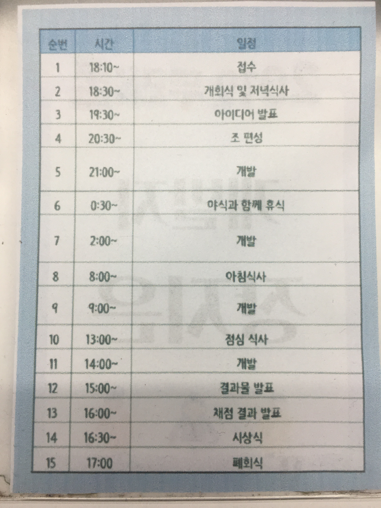

# 2019-kookmin-lecture
2019 1학기 국민대학교 산업체특강 lec 1  
 
-5월 24일 ~ 5월 25일 국민대학교 해커톤 (두리톤) 참가-
 
지난 5얼 24일 ~ 5월 25일 이틀 동안 국민대학교 소프트웨어융합대학과 경영대학이 주최하여 국민대학교 해커톤(두리톤)에 참가하였다.  
일정은 다음과 같았다. 
 
국민대학교 소프트웨어학과 박종복 학우와 경영대학 빅데이터학과 윤준영학우, 김다현 학우와 팀을 이루어 맛집 리뷰 어플리케이션 '현지 맛집'을 제작하였다. 
<iframe width="640" height="360" src="./media_src/현지맛집_시연.mp4" frameborder="0" gesture="media" allowfullscreen=""></iframe>

