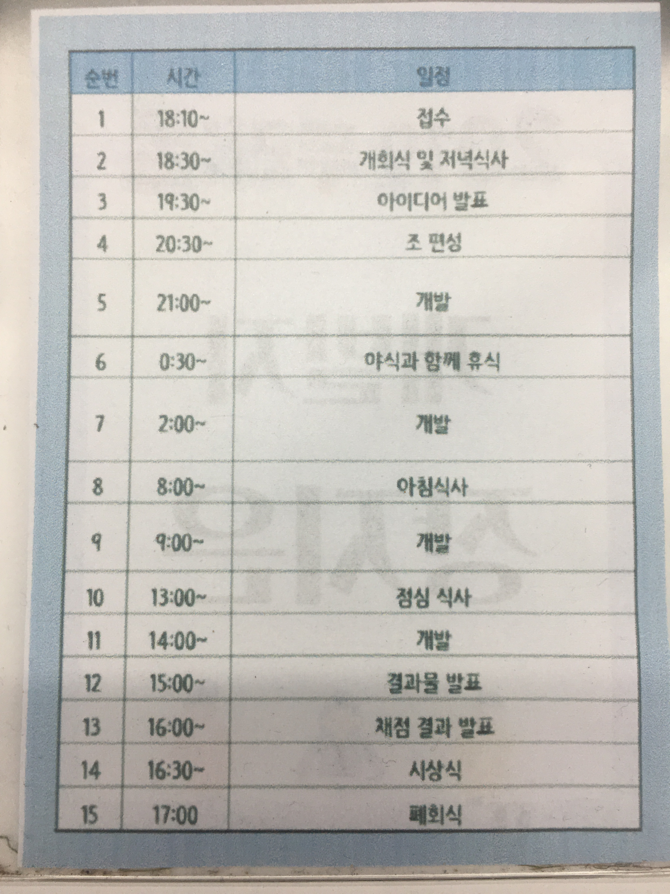
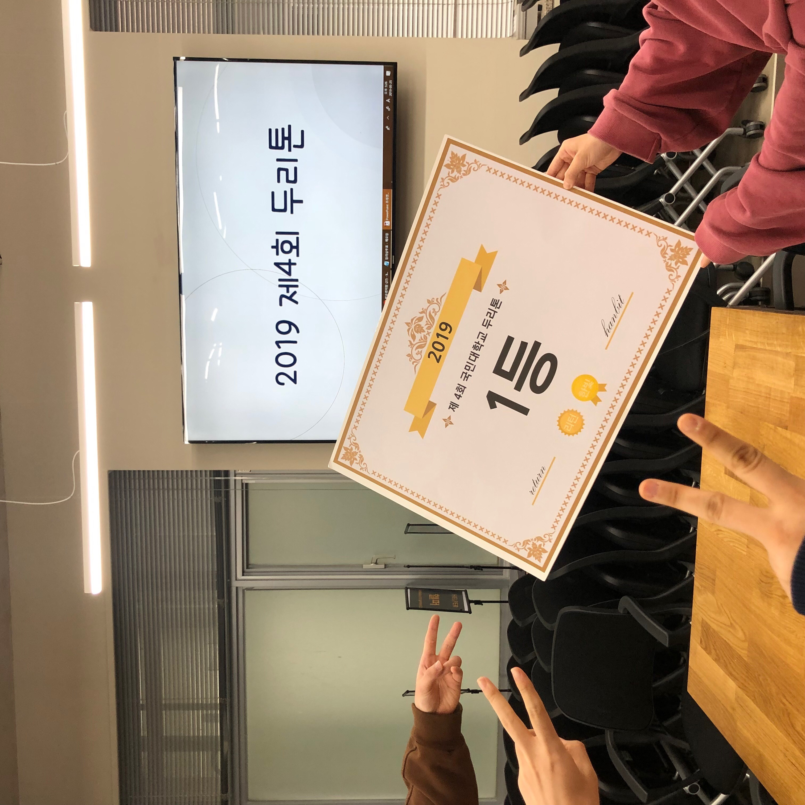
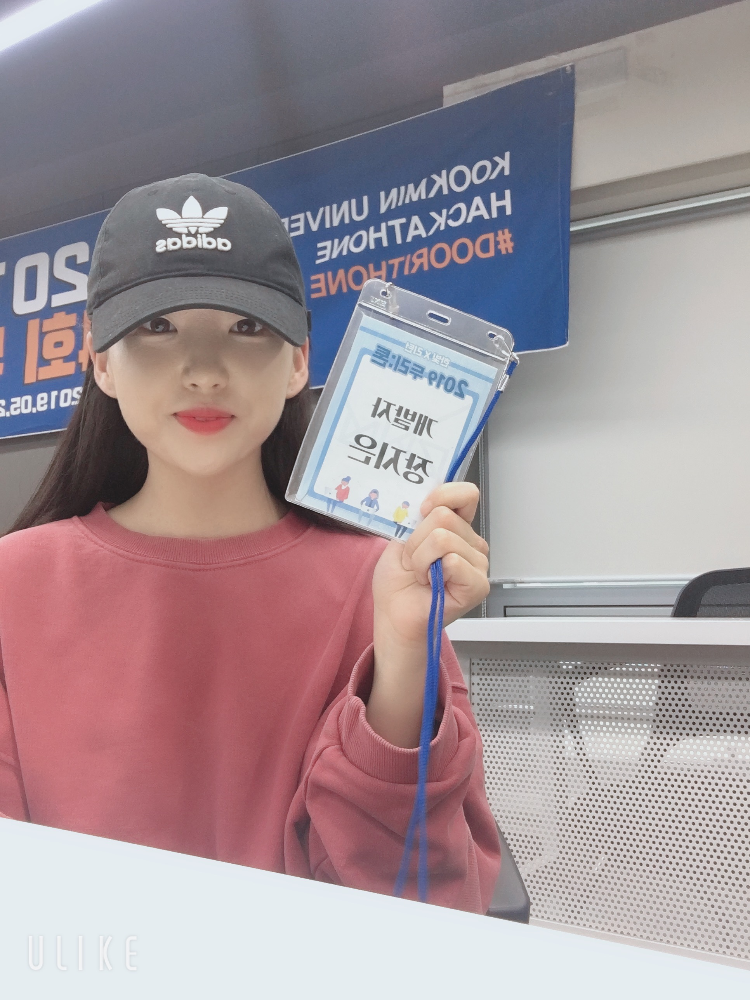

# 2019-kookmin-lecture
2019 1학기 국민대학교 산업체특강 행사 참여 보고서  
 
-5월 24일 ~ 5월 25일 국민대학교 해커톤 (두리톤) 참가- 
 
지난 5얼 24일 ~ 5월 25일 이틀 동안 국민대학교 소프트웨어융합대학과 경영대학이 주최하여 국민대학교 해커톤(두리톤)에 참가하였다.
일정은 다음과 같았다. 
   
이번 해커톤 주제는 어린이, 여행, 스트레스였고 기획자들이 미리 준비해놓은 기획안을 보고 개발자들이 주제를 선택하는 시스템이었다. 
여러 훌륭한 기획안 발표를 듣고 팀 선정 시간을 거쳐... 국민대학교 소프트웨어학과 박종복 학우와 경영대학 빅데이터학과 윤준영학우, 김다현 학우와 팀을 이루어 맛집 리뷰 어플리케이션 '현지 맛집'을 제작하였다. 
 
기존 맛집 리뷰 시스템에서는 TV나 SNS에 소개된 맛집이 아닌 현지인들만 아는 맛집을 구분짓기 어렵다는 점에서 착안하여 사용자들이 메일을 통해 관리자에게 현지인이라는 인증을 받은 후 해당 지역의 맛집에 관해 리뷰를 올릴 수 있게 함으로써 차별점을 두었다. 
아래 사진을 클릭하면 시연 연상을 볼 수 있다. 
  
 
자세한 소스 코드와 PPT는 아래 github 주소에서 볼 수 있다. 
https://github.com/jangjieun00/2019_KMU_Hackathon_team6 
이 프로젝트로 이번 해커톤 대상을 받았다.  
  

처음으로 참가한 해커톤 프로젝트였는데 짧은 시간동안 집중하여 하나의 프로젝트를 만드는 경험을 해보니 재밌고 뿌듯했다! 
상을 목적으로 참가한 대회는 아니었지만 뜻밖에도 좋은 성적을 거두어 밤새 팀원들과 고생한 보람이 있었다 
30시간 가까이 잠을 못자서 피곤했지만! 앞으로 다른 해커톤 대회에도 꾸준히 참가할 계획이다 (그 때는 잠을 충분히 자고 대회에 참가해야겠다..  
 
아래는 참가 사진이다  
  
 
