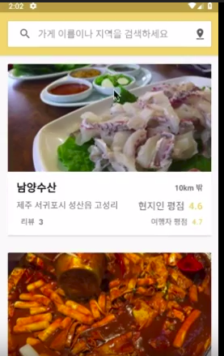

# 2019-kookmin-lecture
2019 1학기 국민대학교 산업체특강 lec 1  
 
-5월 24일 ~ 5월 25일 국민대학교 해커톤 (두리톤) 참가-
 
지난 5얼 24일 ~ 5월 25일 이틀 동안 국민대학교 소프트웨어융합대학과 경영대학이 주최하여 국민대학교 해커톤(두리톤)에 참가하였다.  
일정은 다음과 같았다. 
 
국민대학교 소프트웨어학과 박종복 학우와 경영대학 빅데이터학과 윤준영학우, 김다현 학우와 팀을 이루어 맛집 리뷰 어플리케이션 '현지 맛집'을 제작하였다. 
 
기존 맛집 리뷰 시스템에서는 TV나 SNS에 소개된 맛집이 아닌 현지인들만 아는 맛집을 구분짓기 어렵다는 점에서 착안하여 사용자들이 메일을 통해 관리자에게 현지인이라는 인증을 받은 후 해당 지역의 맛집에 관해 리뷰를 올릴 수 있게 함으로써 차별점을 두었다. 
아래는 시연 연상이다. 
  

