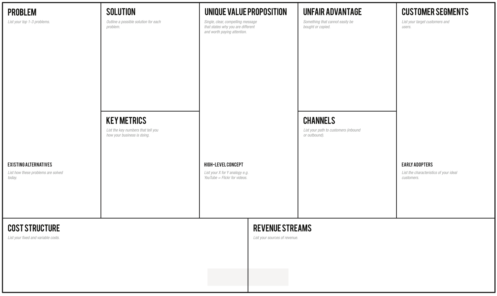

# 2019-kookmin-lecture
2019 1학기 국민대학교 산업체특강 lec 3  
 
-6월 3일 블록체인 : 유진호 개발자 (아이콘루프) -
 
주제: 성공적인 소프트웨어 프로젝트  
소프트웨어 프로젝트는 거의 성공하지 못하는 혹률이 거의 70%에 가깝다.  
여기서 실패의 정의는 예산을 투자했음에도 불구하고 기능이 제대로 동작하지 않는 것이다 
소프트웨어 서비스나 프로덕트는 아주 신중히 고민하고 신경써서 기획해야한다  
**소프트웨어 production** -> 실질적으로 production이라는 작업을 통해 실패확률을 줄이고 나아질 것인가 고민해본다. 
software production이란 무엇인가? 
예시) Disney studio의 제작 프로세스, 영화 제작의 production 단계 .. 
프로젝트의 성공률 : 폭포수 모델 < 애자일 모델  
실패 확률은 애자일 모델이 더 낮긴 하지만 그래도 실패를 함!   
디자인 챌린지 : Design challenge 
->질문의 질이 답의 질을 결정한다!! 
방법1) 어떻게 하면 ~ 할 수 있을까? 질문하기 
방법2) Lean canvas  

방법3) working backwards 
거꾸로 제품을 만드는 방법 : 발표자료를 먼저 만들어라! 또는 컨퍼런스 발표 자료를 만들어라  
제품을 발표하고자 하는 자리를 상상해보고 실제 어떤 제품을 만들었다고 말을 하려고하는지 슬라이드를 만들어본다. 
 
고객이 실제로 원하는 것을 찾기 : 인터뷰 및 관찰활동 , CDM과 같은 인지 분석 활동 (기획자가 하는 일)   
새로운 것을 자꾸 발견할 수 있어야한다. 
초기 단계일 수록 문서는 일부러 짧게 쓴다. 생각을 단순하게 만들기 좋다 (자료수집은 많이 한다.) 외국어로 작성하는 것도 추천 
 
올라간 서비스나 돌아가는 소프트웨어가 제대로 도는지 바로 보는 방법! 
Jenkins Travis CI 사용하여 Continuous integration, Continuous Distribution/Deployment를 만든다. 
Git flow와 같이 Branch를 이용한 기능 개발 관리를 이용하고 Merge가 될 때마다 C/I, C/D를 돌아가게 해야한다.  
Unit test/ integration test는 반드시 있어야한다.  
ios: Test flight 
android : google play console - open/close test 
web service : docker image로 배포, staging server를 구축해서 Blue/green deployment전략을 이용해서 배포 테스트 
 
Google analytics 등을 사용하여 고객들이 어떤식으로 소프트웨어를 이용하는지 추적해 볼 수 있다. 
ELk stack - 로그 데이터들을 시각화 하고 정리해준다. 
사용자 경험 데이터 자체가 자산이다.
Flash build 
